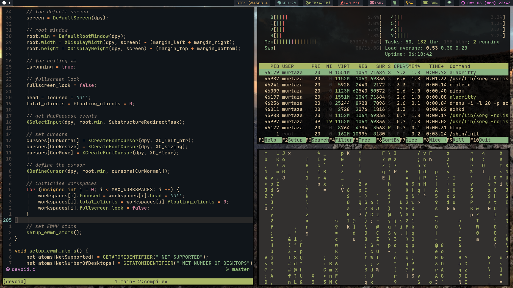

# Devoid WM
> A simple x11 tiling window manager



Devoid tries to abide by the principle - "Do one thing, do it well". All it is
is a window manager which manages windows. It neither come with a bar nor does
it have the ability to spawn programs. Users are meant to use external well
written and robust programs like the `sxhkd` for binding keys and `lemonbar`.
Like dwm, devoid is configured by editing the source code directly.

The layout that `devoid` uses is the master-slave or the tiled layout
```
|-----------|-------|
|           |   s   |
|           |       |
|     M     |-------|
|           |       |
|           |   s   |
|-----------|-------|
```

# Note
- `dwmblocks` like program for lemonbar?
check out [lemonaid](https://github.com/Murtaza-Udaipurwala/lemonaid)

- The documentation is a work in progress. However if you happen to use dwm,
  configuring devoid should be very similar.

- `Devoid` is still under a testing phase, however it is pretty usable.

- More features will be added sooner or later. All pull requests are welcomed.

- Some function implementation is taken from other window managers like `dwm` and `catwm`
